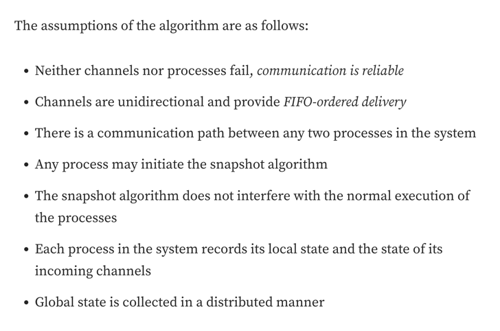
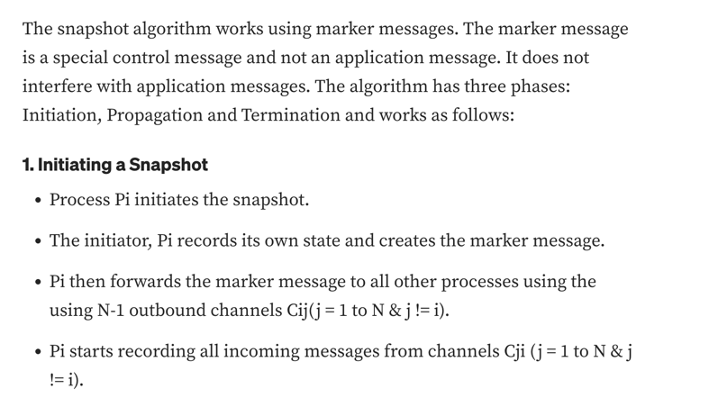
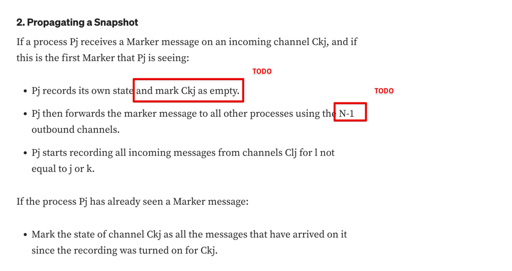
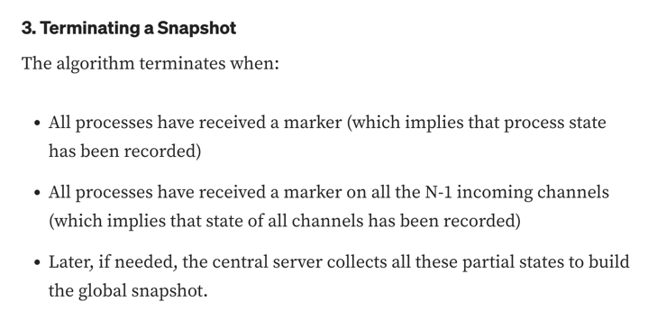
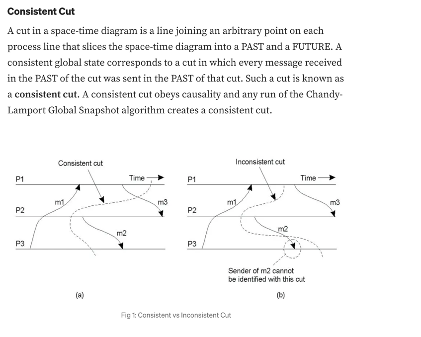
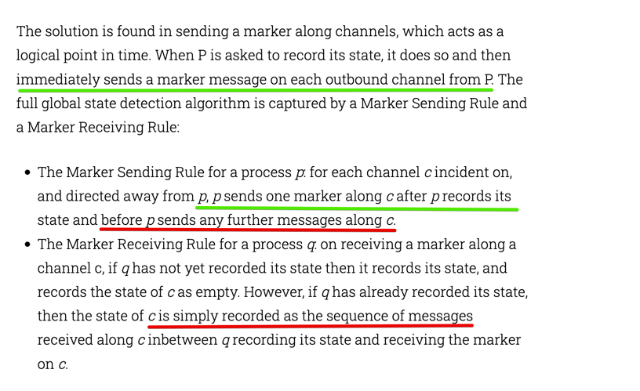
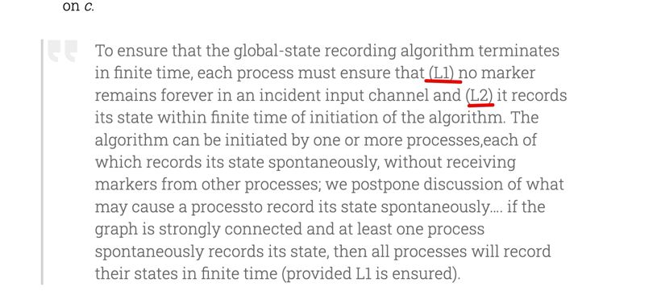

### Ref Link

- [acolyer](https://blog.acolyer.org/2015/04/22/distributed-snapshots-determining-global-states-of-distributed-systems/)
- [medium](https://medium.com/big-data-processing/global-snapshot-chandy-lamport-algorithm-consistent-cut-ec85aa3e7c9d)

### Core Ideas

### Requirements

### Working 1
>  The algorithm has three phases: Initiation, Propagation and Termination and works as follows

### Working 2

> if the graph is strongly connected and at least one process spontaneously records its state, then all processes will
> record their states in finite time (provided L1 is ensured).

> The global state recorded by the algorithm may not correspond exactly to any state the system was in at a given point
> in time, but it does provide a logically consistent snapshot of a state that is guaranteed to be reachable from the
> initial system state, and from which the final (terminal) system state is reachable.
