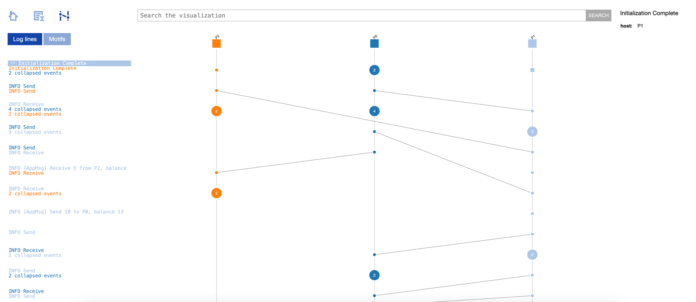

# Distributed Snapshot

Chandy Lamport Algorithm.

### Reference
- [Project 1](https://github.com/FreddyMartinez/chandy-lamport-go)
- [Project 2](https://github.com/mariuscrsn/GlobalStateSnapshot)

### Vector Clock Trace



### Command To Generate Shiviz Log

1. Run the following to generate the log file
```shell
go install github.com/DistributedClocks/GoVector

GoVector --log_type shiviz --log_dir /Users/arjunsunilkumar/GolandProjects/0sysdev_dec/chandy-lamport-go/govector --outfile final.log
```

2. 